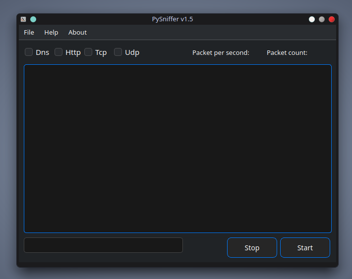
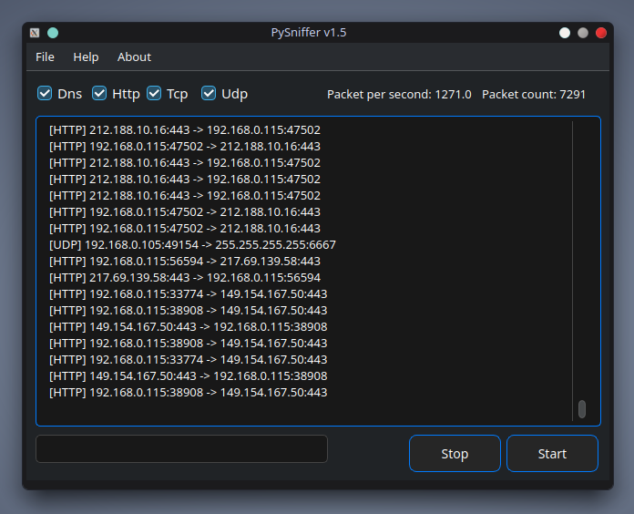

<div align="center">

# 🕵️‍♂️ PySniffer
**Modern, high-performance network traffic analyzer powered by Python.**

[](https://www.python.org)
[](https://www.riverbankcomputing.com)
[](https://scapy.net)
[](LICENSE)

[Обзор](#особенности) • [Установка](#установка) • [Использование](#использование) • [Скриншоты](#скриншоты)

</div>

---

## 📖 О проекте
**PySniffer** — это современный инструмент для перехвата и анализа сетевого трафика. В отличие от консольных аналогов, проект предлагает интуитивно понятный графический интерфейс, сохраняя при этом всю гибкость и мощь библиотеки Scapy. 

Проект написан на **100% на Python**, что делает его легко расширяемым и кроссплатформенным.

## ✨ Особенности
- 🚀 **Real-time Sniffing:** Мгновенный захват входящих и исходящих пакетов.
- 🔍 **Умная фильтрация:** Фильтруйте трафик по протоколам (TCP, UDP, ICMP, HTTP и др.) в один клик.
- 🎨 **Современный GUI:** Интерфейс на базе PyQt6 с поддержкой масштабирования и высокой отзывчивостью.
- 📊 **Детальный разбор:** Анализ структуры каждого пакета вплоть до полезной нагрузки (payload).
- 🐍 **Pure Python:** Никаких сложных зависимостей на C, только чистый и понятный код.

## 🛠 Технологический стек
*   **Язык:** Python 3.x
*   **Сниффинг:** [Scapy](https://scapy.net)
*   **Интерфейс:** [PyQt6](https://pypi.org)

## 📸 Скриншоты
 

## 🚀 Установка

1. **Клонируйте репозиторий:**
   ```bash
   git clone https://github.com/ghostemanelxrd123-creator/PySniffer.git
   cd PySniffer
   sudo -E python3 PySniffer.py
## 🔥 Приятного пользования!
   
